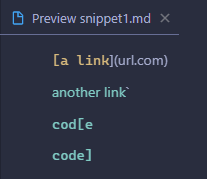
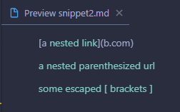
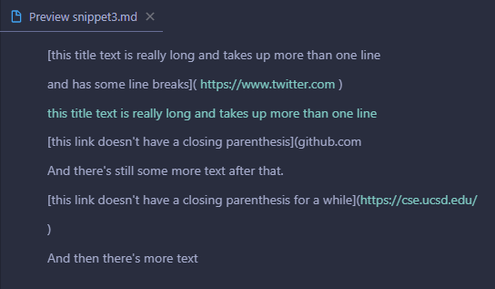

# Introduction
Three different tests will be used for two different implementations of the markdown parse program. The two programs being used today are [my groups implementation](https://github.com/cdavisj/markdown-parse) and [another groups implementation](https://github.com/floatboat/markdown-parse) which we reviewed previously. Following is the file snippets in which I will be testing here, as well as a rendered preview showing us where links are actually registered based on the markdown language.

### Snippet 1
```
`[a link`](url.com)

[another link](`google.com)`

[`cod[e`](google.com)

[`code]`](ucsd.edu)
```



A link is registered for `` `google.com``, `google.com`, and `ucsd.edu`.

### Snippet 2
```
[a [nested link](a.com)](b.com)

[a nested parenthesized url](a.com(()))

[some escaped \[ brackets \]](example.com)
```



A link is registered for `a.com`, `a.com(())`, and `example.com`.

### Snippet 3
```
[this title text is really long and takes up more than 
one line

and has some line breaks](
    https://www.twitter.com
)

[this title text is really long and takes up more than 
one line](
    https://ucsd-cse15l-w22.github.io/
)


[this link doesn't have a closing parenthesis](github.com

And there's still some more text after that.

[this link doesn't have a closing parenthesis for a while](https://cse.ucsd.edu/


)

And then there's more text
```



A link is registered for `https://www.twitter.com`, `https://ucsd-cse15l-w22.github.io/`, `https://cse.ucsd.edu/`.

## Results
### My Program
```
There were 3 failures:
1) testSnippet1(MarkdownParseTest)
java.lang.AssertionError: expected:<[`google.com, google.com, ucsd.edu]> but was:<[url.com, `google.com, google.com]>
        at org.junit.Assert.fail(Assert.java:89)
        at org.junit.Assert.failNotEquals(Assert.java:835)
        at org.junit.Assert.assertEquals(Assert.java:120)
        at org.junit.Assert.assertEquals(Assert.java:146)
        at MarkdownParseTest.testSnippet1(MarkdownParseTest.java:116)
2) testSnippet2(MarkdownParseTest)
java.lang.AssertionError: expected:<[https://www.twitter.com, https://ucsd-cse15l-w22.github.io/, https://cse.ucsd.edu/]> but was:<[]>
        at org.junit.Assert.fail(Assert.java:89)
        at org.junit.Assert.failNotEquals(Assert.java:835)
        at org.junit.Assert.assertEquals(Assert.java:120)
        at org.junit.Assert.assertEquals(Assert.java:146)
        at MarkdownParseTest.testSnippet2(MarkdownParseTest.java:127)
3) testSnippet3(MarkdownParseTest)
java.lang.AssertionError: expected:<[a.com, a.com(()), example.com]> but was:<[a.com, a.com((, example.com]>
        at org.junit.Assert.fail(Assert.java:89)
        at org.junit.Assert.failNotEquals(Assert.java:835)
        at org.junit.Assert.assertEquals(Assert.java:120)
        at org.junit.Assert.assertEquals(Assert.java:146)
        at MarkdownParseTest.testSnippet3(MarkdownParseTest.java:138)

FAILURES!!!
Tests run: 12,  Failures: 3
```

### Other Program
```
There were 3 failures:
1) testSnippet1(MarkdownParseTest)
java.lang.AssertionError: expected:<[`google.com, google.com, ucsd.edu]> but was:<[url.com, `google.com, google.com, ucsd.edu]>
        at org.junit.Assert.fail(Assert.java:89)
        at org.junit.Assert.failNotEquals(Assert.java:835)
        at org.junit.Assert.assertEquals(Assert.java:120)
        at org.junit.Assert.assertEquals(Assert.java:146)
        at MarkdownParseTest.testSnippet1(MarkdownParseTest.java:42)
2) testSnippet2(MarkdownParseTest)
java.lang.AssertionError: expected:<[https://www.twitter.com, https://ucsd-cse15l-w22.github.io/, https://cse.ucsd.edu/]> but was:<[a.com, a.com((, example.com]>
        at org.junit.Assert.fail(Assert.java:89)
        at org.junit.Assert.failNotEquals(Assert.java:835)
        at org.junit.Assert.assertEquals(Assert.java:120)
        at org.junit.Assert.assertEquals(Assert.java:146)
        at MarkdownParseTest.testSnippet2(MarkdownParseTest.java:53)
3) testSnippet3(MarkdownParseTest)
java.lang.AssertionError: expected:<[a.com, a.com(()), example.com]> but was:<[, , ]>
        at org.junit.Assert.fail(Assert.java:89)
        at org.junit.Assert.failNotEquals(Assert.java:835)
        at org.junit.Assert.assertEquals(Assert.java:120)
        at org.junit.Assert.assertEquals(Assert.java:146)
        at MarkdownParseTest.testSnippet3(MarkdownParseTest.java:64)

FAILURES!!!
Tests run: 7,  Failures: 3
```
