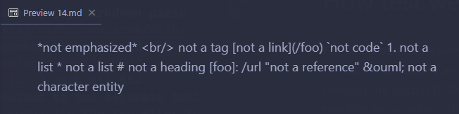
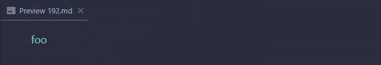

# How tests were found
For this report, tests were found by running [my markdown parse implementation](https://github.com/cdavisj/markdown-parse/blob/main/MarkdownParse.java) and the implementation [here](https://github.com/ucsd-cse15l-w22/markdown-parse/blob/main/MarkdownParse.java) with all 652 commonmark-spec tests and sending the output to two separate text files. Then the `diff` command was ran comparing the two files to see where the output differed. This result was sent to its own separate text file for analysis. I simply picked the first two test from this diff file.

**Note**: the diff command was used with my implementation's output as the first argument and the other implementation's output as the second argument. So `<` indicates what was outputted from my implementation and `>` indicates what was outputted from the other implementation.

## Test 1
`14.md`
```markdown
`\*not emphasized*
\<br/> not a tag
\[not a link](/foo)
\`not code`
1\. not a list
\* not a list
\# not a heading
\[foo]: /url "not a reference"
\&ouml; not a character entity``markdown
```

Rendering this markdown file within vscode, we get the following output.



This indicates that we should have no links parsed from this file. 
The diff file shows the following:
```
< []
---
> [/foo]
```
That is, my implementation found no links while the other implementation found a single link of `/foo`. Since the expected output for this test is no links, the other implementation incorrectly found a link.

Based on the output, the other implementation is not correctly omitting escaped characters associated with the potential link. First opening bracket `[` should be omitted since there is a backward slash `\` just before it. This fix could be applied when finding `nextCloseBracket` at the beginning of the while-loop in `getLinks(String)`. This is the middle line in the below code. There should be a check that this bracket is not an escaped character by making sure there is no backslash in the previous index.

```java
while (currentIndex < markdown.length()) {
    int nextOpenBracket = markdown.indexOf("[", currentIndex);
    int nextCodeBlock = markdown.indexOf("\n```");
```

## Test 2
`192.md`
```markdown
[foo]: /url "title"

[foo]
```

Rendering this markdown file within vscode, we get the following output.



This indicates that we should have some link parsed from this file. Based on the markdown file, we expect `/url` as a link. This is using the format "Reference Links" as described [here](https://www.w3schools.io/file/markdown-links/).
The diff file shows the following:
```
< [/url]
---
> []
```

That is, my implementation found a link for `/url`, but the other implementation did not find any links. Thus, the other implementation is incorrect in this case based on aforementioned discussion of what is correct. 

The other implementation is not accounting for links of this type of format. That is links of the format `[<text>]: <link> <title>`. In this format, the `<title>` is shown when hovering over the link, the `<text>` is shown in the rendered html, and the `<link>` is the destination when clicking the link. One potential fix for this is to check for a colon `:` character after finding `nextCloseBracket` and render the link based on this format when we find a following colon. The place where this can be added is right after the assignment of `nextCloseBracket` in the `getLinks(String)` method as shown below.

```java
while (currentIndex < markdown.length()) {
    int nextOpenBracket = markdown.indexOf("[", currentIndex);
    int nextCodeBlock = markdown.indexOf("\n```");
    if (nextCodeBlock < nextOpenBracket && nextCodeBlock != -1) {
        int endOfCodeBlock = markdown.indexOf("\n```");
        currentIndex = endOfCodeBlock + 1;
        continue;
    }
    int nextCloseBracket = markdown.indexOf("]", nextOpenBracket);
```
