# Remote Servers
A remote server is essentially just a computer located somewhere else, such as a work site. You can connect to such a server to do remote work from home using something called [ssh](https://en.wikipedia.org/wiki/Secure_Shell), standing for *secure shell*. Let us start with how to do this.

## Connecting to a server via ssh
Let it be known, this lesson is in the context of connecting to UCSD's ieng6 server as a student. 

### Setup
Firstly, if you are a Windows user, you will need to make sure that you have OpenSSH installed. To do this, open up the Windows PowerShell as an administrator. Running the following command to check if you have it.

```powershell
Get-WindowsCapability -Online | Where-Object Name -like 'OpenSSH*'
```

If you don't have it installed, you will see something like this.
```
Name  : OpenSSH.Client~~~~0.0.1.0
State : NotPresent

Name  : OpenSSH.Server~~~~0.0.1.0
State : NotPresent
```

Note, there are two separate components to OpenSSH needed, the first is the client, and the second is the server. You can run the following commands as needed depending on the above output.
```powershell
# Install the OpenSSH Client
Add-WindowsCapability -Online -Name OpenSSH.Client~~~~0.0.1.0

# Install the OpenSSH Server
Add-WindowsCapability -Online -Name OpenSSH.Server~~~~0.0.1.0
```

Now you should be ready to connect! 

### Connecting
Again, in Windows PowerShell, make sure you are an administrator. You can connect to your remote server via the command `ssh username@servername`. As a student, you can retrieve your username by looking yourself up [here](https://sdacs.ucsd.edu/~icc/index.php). As mentioned, we are going to be working with the ieng6 server, so the server name will be `ieng6.ucsd.edu`. With this information, you can now get connected to the server by running the above command. Here is an example of what this should look like.
```PowerShell
ssh cs15lwi22___@ieng6.ucsd.edu
```
The underscores will be replaced by your unique number. Furthermore, depending on what year and quarter this is, you are going to likely have a different initial portion. Notice it is simply the course name followed by a shortened version of the quarter. In this case, it is Winter 2022.

Once you've run this command, you will be prompted to confirm that you want to connect, at which you can just say "yes". As long as this is a trusted server. You will then need to enter the password corresponding to your school login.

You should see an output similar to this.
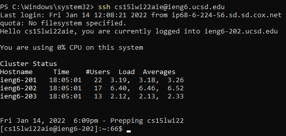

Congratulations, you are officially connected to the remote server! The next thing to do is try out some commands.

## Commands
### Moving around and creating folders
Now to try some commands on the server. The first commands you can try are `ls` (list directory) and `cd <folder-name>` (change directory).

Firstly, try `ls` to see what the starter directory is looking like.
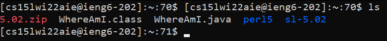

Your directory is going to look slightly different from this one, but you should see some files and/or folders listed. One more thing to know, you won't see all files and folder when you use `ls` on its own. By default, there are going to be some hidden files. In order to see everything hidden as well, you can add the `-a` or `-all` argument with the `ls` command. They both do the same thing so take your pick!
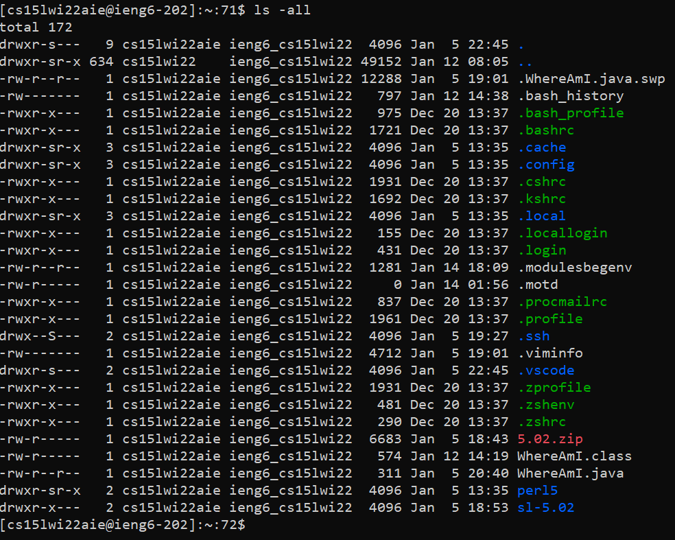

Now for trying out the `cd` command to change your working directory. In order to leave the default folders alone, we can make a new blank directory/folder to `cd` into. This can be done with the `mkdir <folder-name>` (make directory) command. Once you create a new directory, you can check that it was created properly by again making use of the `ls` command.
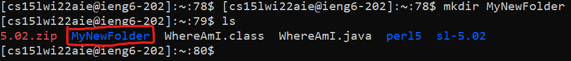

As we can see, a new folder was successfully created! Now we can go ahead and `cd` into this new folder. One nice shortcut to keep in mind, is you can press the tab key after typing the first few letters for autocomplete finish the folder name for you. Once you are in the new directory, you can verify the current folder you are in by typing the `pwd` (print working directory) command.
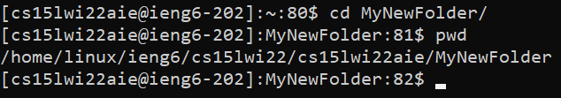

Another useful command argument for `cd` to keep in mine is the `..` as a directory. This is universally known as "go back one folder". If you would like to go back to the default working directory you can do that as such..

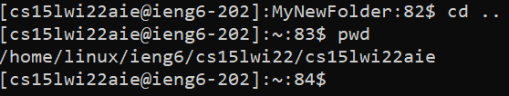

### Copying files from your computer to the server
Now that you know how to move around the directories, you should know how to copy files from your computer over to the server. This can be done with the `scp` (secure copy) command. 

To do this, you will need to open a new PowerShell instance, or press `ctrl+D` to exit the server on your current one. Let us create a simple text file to move over to the server. You can do this by simply navigating to the current folder on your computer via the file explorer, and creating a new text file with the windows UI. Put some simple text in the new file, then save and exit. For the example, I will create a file called `Welcome.txt` and enter the text `Welcome to the server!`.

As we can see the file is showing up when we list it out in our directory, so we are ready to copy!
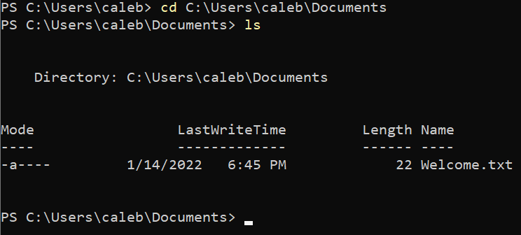

Now we can use the `scp` command in conjunction with `ssh` to copy this folder over to our server. 
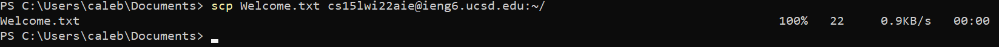

Once you see 100% on the status, this means the folder is successfully copied over. Now can connect back to the server and check on our file!
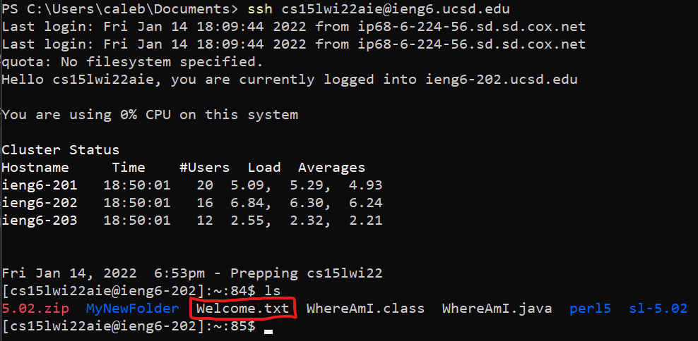

To look into the contents of the file, we can use a command line text editor called `vim` (Vi improved). Simply type `vim <file-name>` to open up the file in vim.

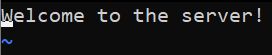

We won't worry about editing files for now with vim. For now you can close the file from vim by typing `:q`. 

You have successfully copied a file over to the server, and opened it up with vim! 

### Setting up SSH keys for automatic login
Now that we've learned to login to the remote server, move around folders in directories, copy files over from our home computer, it's time to make the server login easier! You may have noticed by this point, I haven't had a password prompt every time I attempt to either `ssh` into the server, or `scp` a file over. This is because I have a ssh key set up on my desktop which verifies my login automatically such that I don't need to type a password every time. This is very useful if you are constantly connecting, disconnecting, and interacting with the server.

To do this, you can start by generating a public/private key pair via a tool called `ssh-keygen`. You can simply leave the folder as default by pressing enter when it prompts you for a file path. Once you have this setup, you will have to follow some extra steps [here](https://docs.microsoft.com/en-us/windows-server/administration/openssh/openssh_keymanagement#user-key-generation) as a Windows user.

You're almost done! Now you need to copy the public key that was generated over to the server into a `.ssh` folder. Start by connecting back to the server and creating a `.ssh` folder with the `mkdir` command that we talked about. Once this is done, you can disconnect from the server again with `ctrl+D`, and use the `scp` command to copy the public key over as such.
```PowerShell
scp /Users/<username>/.ssh/id_rsa.pub cs15lwi22@ieng6.ucsd.edu:~/.ssh/authorized_keys
```

Make sure this is done altogether as one command. Now you should be able to `ssh` into the server without typing your password, give it a try!

### Optimizing workflow
All of this copying to the server, `ssh`ing into the server, modifying the file and/or running it on the server, can be very laborious to do all the time. We can work with the commands a little to combine all of this into one command! Let's say we have a .java file on our local machine that we want to move over to the server and run. Take this java file I have stored under a the `C:/Remote` directory.
```java
public class WhereAmI {
    public static void main(String[] args) {
        if (System.getProperty("os.name").equals("Linux"))
            System.out.println("You're on the server!");
        else
            System.out.println("You're on your local machine!");
    }
}
```

This file will simply check if your operating system is linux or not to let you know if you are on the server. This is under the assumption that your local machine is not also running linux. In my case, I am on Windows so this is perfectly fine. 

In one command, I can move this file over to the server, compile it with `javac`, run the class file with `java` as such.
```PowerShell
scp /Remote/WhereAmI.java cs15lwi22aie@ieng6.ucsd.edu:~/; ssh cs15lwi22aie@ieng6.ucsd.edu "javac WhereAmI.java; java WhereAmI"
```
This should look as such.
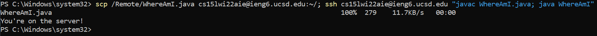

Some notes to help you understand this command. You can break commands up in the command line with semicolons (;). So each time I put a semicolon, I can put a new command afterwards that I would like to be run immediately after the first. Furthermore, you can wrap all the commands you would like to run on the server, after you `ssh` in, in double-quotes. 

You've made it to the end of the lesson! You can return to the main page [here](index.html). There will be a table showing all of the new commands learned!